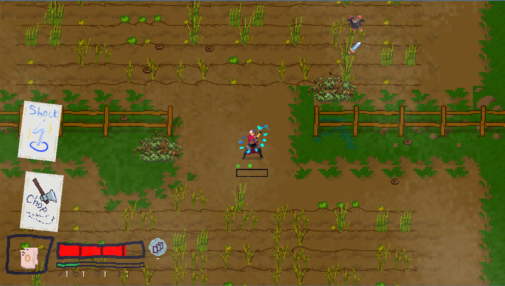
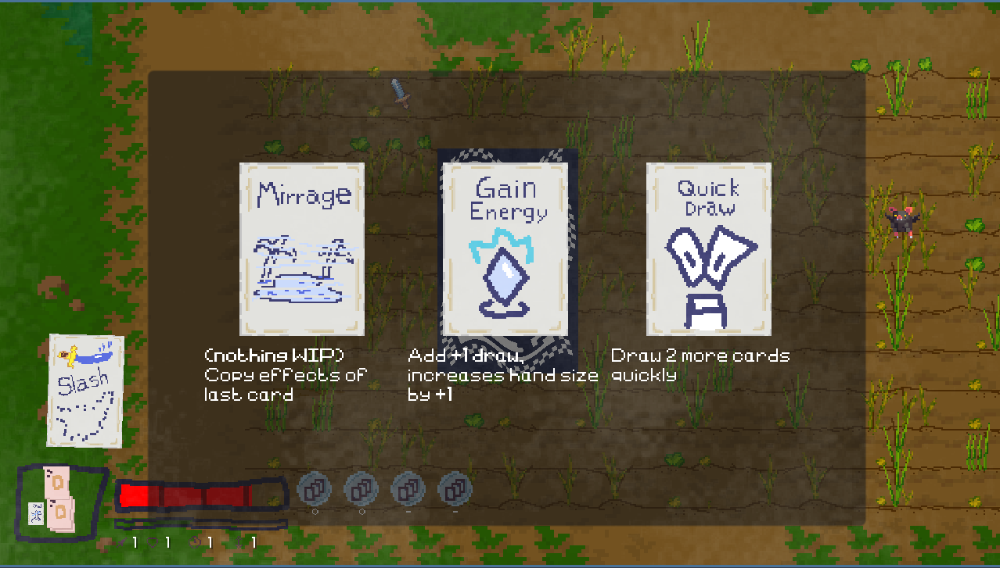

# Deck Shuffler

This project is a "Deck Shuffler" implemented using the Godot Engine. It's a prototype worked on when first learning Godot.

## Features

- **Deck Creation**: Initialize a deck with a specified number of cards.
- **Shuffle Algorithm**: Randomly shuffle the cards in the deck to ensure fair results.
- **Draw Functionality**: Draw cards from the deck and manage the state of remaining cards.
- **Card Reset**: Ability to reset the deck to its original state or after shuffling.

## Scripts and Key Components

- **Deck.gd**: Manages the logic for handling cards, shuffling, drawing, and resetting.
- **Card.gd**: Represents an individual card, including properties like type, value, or special effects.
- **Main.tscn**: The root scene demonstrating deck shuffling and card operations.

## Contributing

1. Fork the repository.
2. Create a new branch for your feature or bugfix.
3. Commit your changes with clear descriptions.
4. Create a pull request to merge changes back into the main branch.

## License

This project is licensed under the MIT License - see the [LICENSE.md](LICENSE.md) file for details.

